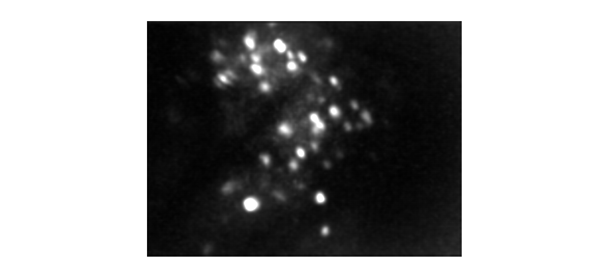
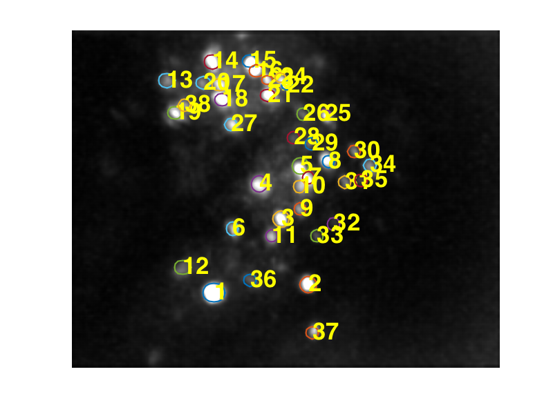
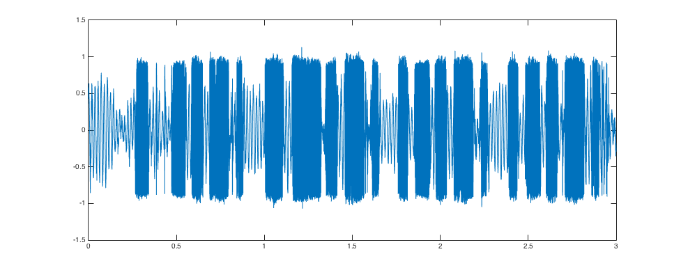

# Basic Analysis Pipeline

This code serves as a basic analysis pipeline for extracting fluorescence time series traces from the .mov files generated from the FreedomScopes. While this is a basic workflow, the exported .mov files can be used with any analysis software.


1. Log each .mov file from each recording session in  a dedicated directory for each session. i.e. store each animal in a separate directory ( I typically have a subfolder for each day of imaging.)


2. When you are done for the day/session, open the directory you made in the last step in MATLAB, and run:

```
>> FS_AV_Parse.
```

This will parse the .mov files into matlab-readable .m files, and will created a cell array for video data, and a corresponding cell array with synchronized analog data. The use of this synchronization cell array will vary from one user's application to another- I myself use it for aligning to zebrafinch song (as an audio channel) others will use this as a sync to sone behavioral paradigm, i.e. a TTL input. While the format contains:

% Audio structure:
```
audio.nrChannels
audio.bitsnrFrames
audio.data
audio.rate
audio.TotalDurration
```

% Video structure
```
video.width
video.height
video.channels
video.times
video.nrFramesTotal
video.FrameRate
video.frames
```

However, in order to be as general as possible, many helper scripts use `height * width * color * frame`  format. There is a legacy format, that uses  video.frame(n).cdata.


3. In the .mat folder, you can then then run:

```
>> FS_DFF_STD_Image
```

... And you will get a directory of images, based on the Max, Average, and Standard deviation projections of each video in the directory that the command is run.

```
>> FS_BatchDff
```

...will make a downsampled, background subtracted video as well as a maximum projection image for each file in your .mat directory. In addition, it will make a Average-maximum projection image called Dff_composite, of all the recordings from the session combined.

At this point, The calcium imaging videos exist in the cell video.frames.cdata contained inside each .m file in the mat folder. It is stored as a 4D matrix (H,W,C,T) and can be plugged into any analysis pipeline- although it may need to be formatted differently depending on your application. A simple 'get off the ground quick' manual ROI selection paradigm follows:


3b. Extract ROIs manually:
load the Dff_composite image into MATLAB:

```
>> IMAGE = imread('Dff_composite');
```



...Or, if you want to just take an ROI mask from one particular image:


```
>> IMAGE = imread('CaptureSession'); % or whatever you name you file...
```


Then, create your ROI mask:
```
>> FS_image_roi(IMAGE);
```
This will open up a GUI to select ROIs from the image you picked. just point over an ROI, click on one you want, drag the mouse out so you get the right size, then unclick your mouse. Then DOUBLE CLICK on the ring you made. it should turn yellow. then you can drag/move the ring over to make another selection.  You can add/move as many ROIs as you want. when you are done, just exit out of the GUI. It will save all your ROIS, and number them...and will create a .tif of your selected ROI map called roi_map_image.tiff, which resides in mat--> image_roi





Then, go into the new 'roi_image' directory and load roi_data_image.mat file into MATLAB

```
>> load('roi_data_image.mat')
```

To extract ROIS from your movies, go back into the .mat directory, and run:

```
>> roi_ave= FS_plot_ROI(ROI);
```
This will extract ROIs, using the mask 'ROI', for every .mat file in the folder.

roi_ave will be saved in the directory 'rois' and it will have all of your ROI time series data in it, as well as calculated dF/F traces, and interpolated traces. you can thumb through the .mat file to check out the data structure. to plot it right away:

```
figure(); plot(roi_ave.interp_time{1},(roi_ave.interp_dff{1,1})); % interpolated df/f
```


```
>> figure(); plot(roi_ave.raw_time{1},(roi_ave.raw_dat{1,1})); % raw data
```


```
figure(); plot(roi_ave.analogIO_time{1},roi_ave.analogIO_dat{1}); % Analog sync'd channel
```



==========================================================

## OPTIONAL CODE

... TBD, Songbird specific scripts are in progress.
