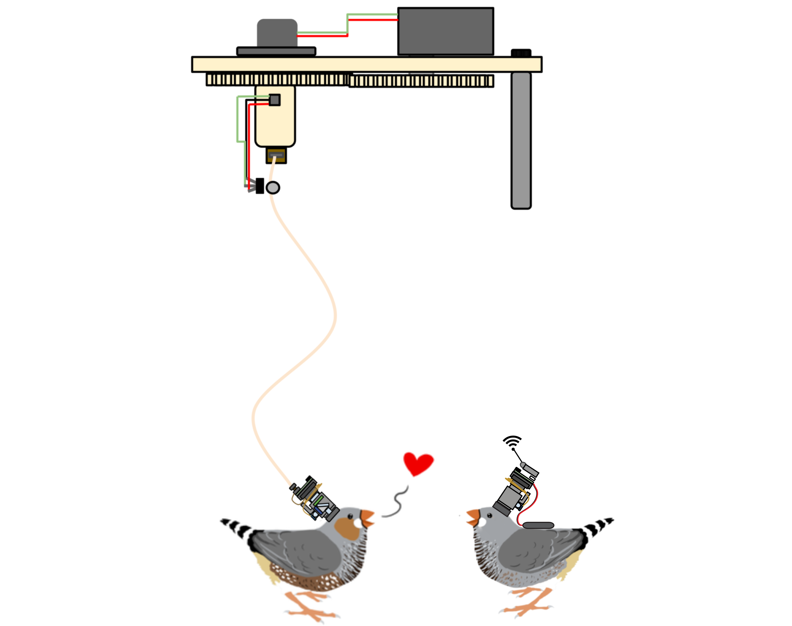
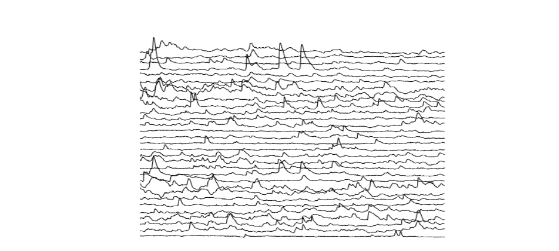

 FinchScope Project
=======

============

## Overview
The FinchScope project aims to provide a modular in-vivo ABA (awake, behaving animal) optophysiology rig, with a transparent acquisition and analysis pipeline. The goal is to produce a customizable and scaleable single-photon fluorescent imaging microscope system that takes advantage of developing open-source analysis platforms.

The project was initially developed in the Gardner Lab, for multi-month imaging of neural activity in songbirds. It has since been adapted for rodents. This effort would not have been possible without the critical advice and support at the outset of the project by Daniel Aharoni and Peyman Golshani, of the [UCLA Miniscope project](https://www.miniscope.org)

<video src="video.mp4" width="320" height="200" controls preload></video>

#### Components:

### Finchscope Microscope

The FinchScope is a lightweight wireless-capable microscope for biological imaging- Designed specifically for monitoring the neural activity (via genetically encoded calcium indicators) of zebra finches while they sing their courtship songs. You can find the Construction and Assembly Guide for [the Microscope](https://github.com/WALIII/FreedomScope/wiki/Assembly-Guide), As well as a for the [Data Acquisition Box (DAQ)](https://github.com/WALIII/FreedomScope/wiki/DAQ-Guide).  Also, we have a [Guide Through a Basic Analysis Pipeline](https://github.com/WALIII/FreedomScope/wiki/Analysis-Guide)

### ActiveComm
The ActiveCom is a low noise active(driven by a motor and sensor) commutator designed for ABA electrophysiology and optophysiology.
